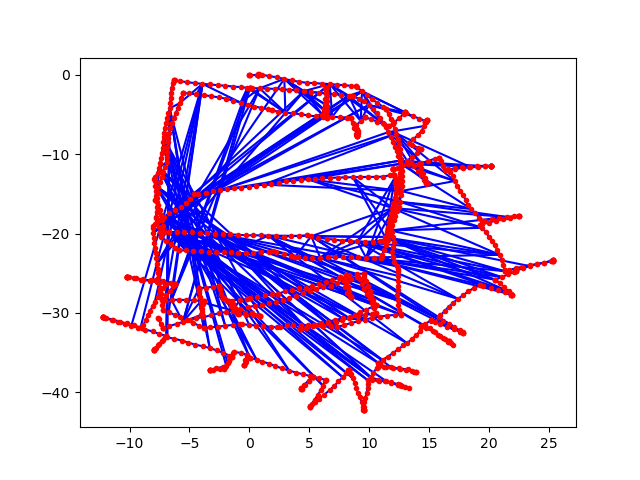
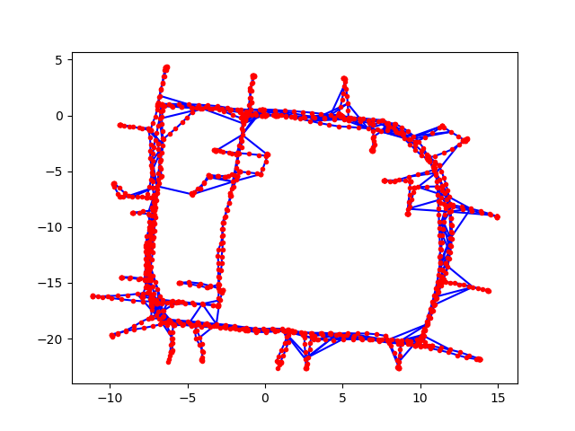
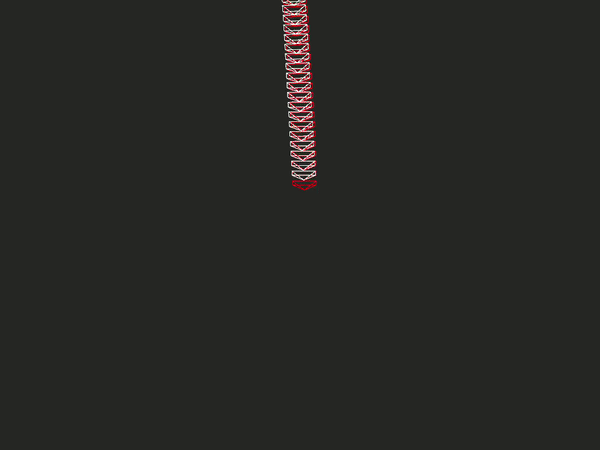
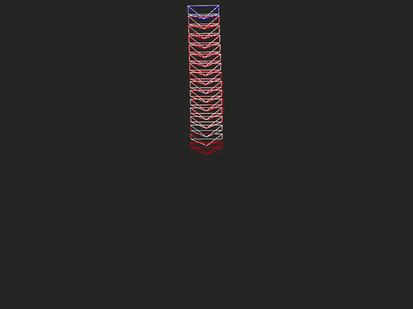
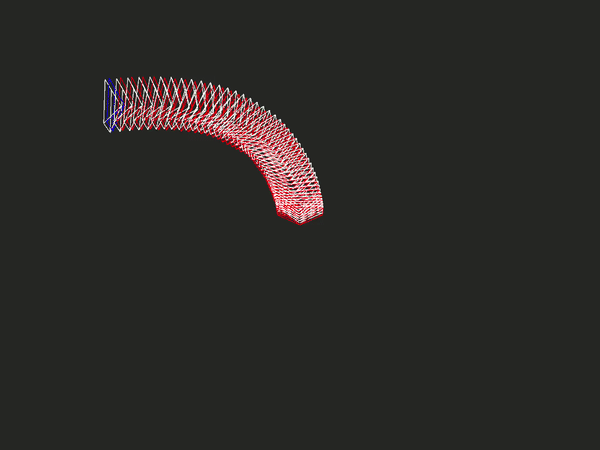

# Graph-SLAM

In this project we have implemented a graph-based SLAM pipeline using 2D laser data and odometry information. We also extended our implementation to accomodate visual data in our SLAM frontend.

These are two seperate Graph-SLAM pipelines. The individual setup and execution instructions are provided in README's of respective implementation directories. Please refer to the project report for detailed explaination.

## 2D Lidar SLAM
In this we implement custom frontend and backend modules. Backend consists of custom 2D Pose Graph construction and optimization implementation. Frontend uses odometry, lidar scan and scan matching to compute graph poses. Loop closure constraints are added using ICP. We first implemented (main_g2o.py) the backend graph optimization using the processed g2o data from [Luca Carlone datasets](https://lucacarlone.mit.edu/datasets/). Once this was achieved, we moved on to using the raw data provided by [Intel Research Lab](http://ais.informatik.uni-freiburg.de/slamevaluation/datasets.php) and building our own pose graph from the laser and odometry information.

Pose Graph before optimization |  Pose Graph after optimization
:-------------------------:|:-------------------------:
  |  

Real-Time Pose Graph Generation and Optimization after Loop Closures
:-------------------------:|

## Visual SLAM

In this we implemented a monocular visual odometry pipeline for frontend. For backend we create pose graph structure based on [g2o library's python wrapper](https://github.com/uoip/g2opy). In order to optimize the pose graph we use Sparse Optimizer from g2o library. The visual odometry frontend is built using 2D-2D feature correspondences between relative frames. We utilize only left camera images from the stereo pair provided in the [KITTI dataset](http://www.cvlibs.net/datasets/kitti/eval_odometry.php) and perform monocular visual odometry. We use SIFT feature detector and Lucas Kanade Tracker to track the features across frames. We compute the relative pose between frames by using the Essential Matrix obtained after performing RANSAC. Using the computed poses we construct our Pose Graph. In order to simplify the scope of our project we use [ground truth poses](http://www.cvlibs.net/datasets/kitti/eval_odometry.php) to detect loop closures.

Sequence 00 | Sequence 05 | Sequence 07
:----------:|:-----------:|:-----------:
 | | 
- white represents the ground truth poses.
- red represents the pose graph without optimization.
- green represents the pose graph after optimization as new loop closures are detected.

## References

[1] G. Grisetti, R. Kummerle, C. Stachniss, and W. Burgard, “A tutorial on graph-based slam,” IEEE Intelligent Transportation Systems Magazine, vol. 2, no. 4, pp. 31–43, 2010.

[2] “Python graph slam reference repository(backend).” https://github.com/JeffLIrion/python-graphslam.

[3] “g2o python wrapper.” https://github.com/uoip/g2opy.

[4] “Graph slam formulation.” https://github.com/AtsushiSakai/PythonRobotics/blob/master/SLAM/GraphBasedSLAM/graphSLAM_formulation.pdf.

[5] “Python graph slam reference repository(frontend).” https://github.com/goktug97/PyGraphSLAM.

[6] “Icp implementation for frontend.” https://github.com/ClayFlannigan/icp.

[7] “Monocular visual slam.” https://github.com/sakshamjindal/Monocular-MiniSLAM.

[8] “Repository of laser and odometry data in carmen format at uni freiburg.” http://ais.informatik.uni-freiburg.de/slamevaluation/index.php.

[9] “g2o format datasets by luca carlone.” https://lucacarlone.mit.edu/datasets/
