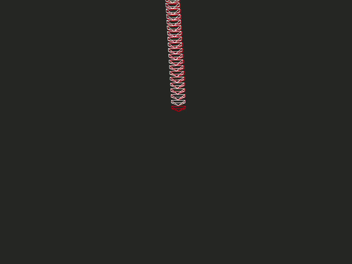

# VISUAL SLAM

In this we implemented a monocular visual odometry pipeline for frontend. For backend we create pose graph structure based on [g2o library's python wrapper](https://github.com/uoip/g2opy). In order to optimize the pose graph we use Sparse Optimizer from g2o library. The visual odometry frontend is built using 2D-2D feature correspondences between relative frames. We utilize only left camera images from the stereo pair provided in the [KITTI dataset](http://www.cvlibs.net/datasets/kitti/eval_odometry.php) and perform monocular visual odometry. We use SIFT feature detector and Lucas Kanade Tracker to track the features across frames. We compute the relative pose between frames by using the Essential Matrix obtained after performing RANSAC. Using the computed poses we construct our Pose Graph. In order to simplify the scope of our project we use [ground truth poses](http://www.cvlibs.net/datasets/kitti/eval_odometry.php) to detect loop closures.

## Setup and Usage

```
conda create -n graph_slam python=3.6
conda activate graph_slam

. install_all.sh

cd visual_slam
python run_slam.py --path ../KITTI_dataset/sequences/00/ --gt_loops ../KITTI_GroundTruth/gnd_kitti00.mat
```

## Results

### Optimized Pose Graphs
Sequence 00 | Sequence 05 | Sequence 07
:----------:|:-----------:|:-----------:
 | | 
- white represents the ground truth poses.
- red represents the pose graph without optimization.
- green represents the pose graph after optimization as new loop closures are detected.

### Translation Errors
Sequence 00 | Sequence 05 | Sequence 07
:----------:|:-----------:|:-----------:
 | | 

## References
[1] https://github.com/luigifreda/pyslam
